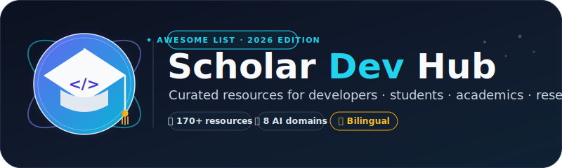

# Scholar Dev Hub — Awesome Curated Resources for Developers, Students, Academics & Researchers

  

  <em>A curated hub of free resources, tools, courses, cheat sheets &amp; best practices for <b>developers</b>, <b>students</b>, <b>professors &amp; academics</b>, and <b>scientists &amp; researchers</b> — with a flagship 2026 AI &amp; Agents section.</em>

  
  
  
  
  

  🌙 <strong>مرحبًا!</strong> دليل شامل يجمع أفضل الموارد والأدوات والدورات المجانية للمبرمجين والطلاب والأساتذة الجامعيين والباحثين في مكانٍ واحد — مع قسم رائد لأدوات الذكاء الاصطناعي والوكلاء لعام 2026. إذا أعجبك المشروع، اضغط ⭐ وشاركه.

---

**⚡ What makes this hub different**

<table>
  <tr>
    <td align="center"><b>🎓 Multi-audience</b> Devs · students · professors · researchers — every audience gets its own lens.</td>
    <td align="center"><b>🧠 Flagship AI &amp; Agents</b> A 2026 section covering MCP, agent frameworks, coding agents, RAG, evals & inference.</td>
  </tr>
  <tr>
    <td align="center"><b>🌍 Bilingual</b> Extensive English index + a dedicated Arabic-resources section.</td>
    <td align="center"><b>✨ Curation over volume</b> Hand-picked, free + open resources — no link farms, no clones.</td>
  </tr>
</table>

> 💡 **Spotlight** — the differentiator: jump straight to the **🧠 AI &amp; Agents** section for the newest tooling in agent frameworks, the Model Context Protocol, coding agents (Claude Code, Cursor, Aider…), RAG &amp; memory, open-model inference, and LLM evaluation/observability.

---

## Contents

- [🧑‍💻 For Developers](#-for-developers)
  - [Roadmaps & Learning Paths](#roadmaps--learning-paths)
  - [Free Books & Courses](#free-books--courses)
  - [Practice & Interview Prep](#practice--interview-prep)
  - [Tools & Cheat Sheets](#tools--cheat-sheets)
- [🧠 AI & Agents](#ai-and-agents)
  - [Agent Frameworks & SDKs](#agent-frameworks)
  - [Model Context Protocol (MCP) & Protocols](#mcp-and-protocols)
  - [Coding Agents & AI-Powered IDEs](#coding-agents-ai-ides)
  - [Browser, Computer-Use & Voice Agents](#browser-computer-use-voice-agents)
  - [RAG, Memory & Knowledge](#rag-memory-knowledge)
  - [Open Models, Inference & Fine-Tuning](#open-models-inference-finetuning)
  - [Evaluation, Observability & Guardrails](#evaluation-observability-guardrails)
  - [Orchestration & Prompt Engineering](#orchestration-prompt-engineering)
- [🎓 For Students](#-for-students)
  - [CS Curricula](#cs-curricula)
  - [Free Learning Platforms](#free-learning-platforms)
  - [Student Perks, Internships & Hackathons](#student-perks-internships--hackathons)
  - [Note-Taking & Study Tools](#note-taking--study-tools)
- [👨‍🏫 For Professors & Academics](#-for-professors--academics)
  - [Teaching & Course Creation](#teaching--course-creation)
  - [Writing & Reference Management](#writing--reference-management)
  - [Academic Profiles & Networking](#academic-profiles--networking)
- [🔬 For Scientists & Researchers](#-for-scientists--researchers)
  - [Literature Discovery](#literature-discovery)
  - [Data Analysis & Visualization](#data-analysis--visualization)
  - [Reproducibility & Open Science](#reproducibility--open-science)
  - [PhD Life & Academic Writing](#phd-life--academic-writing)
- [🤖 AI Tools & Productivity](#-ai-tools--productivity)
- [🌍 الموارد العربية](#-الموارد-العربية)
- [✨ Featured Awesome Lists](#-featured-awesome-lists)

---

## 🧑‍💻 For Developers

### Roadmaps & Learning Paths

- [roadmap.sh](https://roadmap.sh) - Community-driven roadmaps, guides and paths for every developer role (frontend, backend, DevOps, AI, and more).
- [The Odin Project](https://www.theodinproject.com) - Free, open-source full-stack web development curriculum with real projects.
- [Full Stack open](https://fullstackopen.com) - Modern web development course by the University of Helsinki (React, Node.js, GraphQL, TypeScript).
- [Teach Yourself CS](https://teachyourselfcs.com) - A curated path through the core of computer science using the best books and lectures.

### Free Books & Courses

- [free-programming-books](https://github.com/EbookFoundation/free-programming-books) - The most comprehensive list of freely available programming books and courses, in many languages.
- [freeCodeCamp](https://www.freecodecamp.org) - Free interactive certifications in web development, data science, Python, and more.
- [Web Dev for Beginners](https://github.com/microsoft/Web-Dev-For-Beginners) - 24-lesson web development curriculum by Microsoft, with quizzes and projects.
- [30 seconds of code](https://www.30secondsofcode.org) - Short, high-quality code snippets you can understand in 30 seconds or less.

### Practice & Interview Prep

- [Coding Interview University](https://github.com/jwasham/coding-interview-university) - A complete multi-month study plan for software engineering interviews.
- [System Design Primer](https://github.com/donnemartin/system-design-primer) - Learn how to design large-scale systems; the classic prep resource for system design interviews.
- [Tech Interview Handbook](https://github.com/yangshun/tech-interview-handbook) - Curated interview preparation materials, algorithms, and resume guides for busy engineers.
- [JavaScript Algorithms](https://github.com/trekhleb/javascript-algorithms) - Algorithms and data structures implemented in JavaScript with explanations and READMEs.
- [TheAlgorithms](https://github.com/TheAlgorithms) - Open-source algorithm implementations in Python, Java, C++, and many other languages.
- [LeetCode](https://leetcode.com) - The standard platform for practicing coding interview problems.
- [NeetCode](https://neetcode.io) - A curated list of the best LeetCode questions with free video explanations.
- [Build Your Own X](https://github.com/codecrafters-io/build-your-own-x) - Master programming by recreating your favorite technologies from scratch (databases, OS, Git, etc.).
- [Project Based Learning](https://github.com/practical-tutorials/project-based-learning) - Curated list of project-based tutorials for dozens of programming languages.
- [App Ideas Collection](https://github.com/florinpop17/app-ideas) - Project ideas to practice your coding skills, tiered by difficulty.

### Tools & Cheat Sheets

- [cheat.sh](https://cheat.sh) - Unified, community-driven cheat sheets accessible from the command line or browser.
- [Devhints](https://devhints.io) - A ridiculous collection of web development cheatsheets, one page per tool.
- [public-apis](https://github.com/public-apis/public-apis) - A collective list of free APIs for use in software and web development.
- [free-for.dev](https://github.com/ripienaar/free-for-dev) - A list of SaaS, PaaS and IaaS offerings with free tiers for developers.
- [Best Websites a Programmer Should Visit](https://github.com/sdmg15/Best-websites-a-programmer-should-visit) - Useful sites for learning, news, and practicing.
- [Oh My Zsh](https://ohmyz.sh) - Delightful open-source framework for managing your Zsh configuration, with hundreds of plugins.
- [First Contributions](https://github.com/firstcontributions/first-contributions) - Hands-on tutorial that walks you through your very first open-source contribution.
- [Awesome for Beginners](https://github.com/MunGell/awesome-for-beginners) - A list of awesome beginner-friendly projects to contribute to.

---

## 🧠 AI & Agents

> **الحديث والقوي:** قسم مخصّص لأحدث أدوات الذكاء الاصطناعي والوكلاء (AI Agents) لعام 2025–2026 — من أطر بناء الوكلاء إلى MCP، وأدوات البرمجة الذكية، واسترجاع المعرفة المُعزّز (RAG)، وتشغيل النماذج محليًا، وتقييم الوكلاء. هنا تكمُن الميزة التنافسية لهذا الدليل.

### Agent Frameworks & SDKs

- [LangGraph](https://github.com/langchain-ai/langgraph) - Framework for building stateful, controllable multi-actor agents as directed graphs (by LangChain).
- [CrewAI](https://github.com/crewAIInc/crewAI) - Role-based multi-agent framework where you define agents, tasks, and crews in plain Python.
- [AutoGen](https://github.com/microsoft/autogen) - Microsoft's framework for building event-driven, scalable multi-agent conversations.
- [PydanticAI](https://github.com/pydantic/pydantic-ai) - Typed agent framework from the Pydantic team with strong schema validation and streaming.
- [AGNO](https://github.com/agno-agi/agno) - Lightweight framework for building multimodal agents with memory and tools (formerly Phidata).
- [OpenAI Agents SDK](https://github.com/openai/openai-agents-python) - Official OpenAI SDK for orchestrating agents with tools, hand-offs, and guardrails.
- [LlamaIndex](https://github.com/run-llama/llama_index) - The leading data framework for connecting LLMs to your data via workflows and agents.
- [smolagents](https://github.com/huggingface/smolagents) - Hugging Face's minimal library for code-acting LLM agents.
- [Semantic Kernel](https://github.com/microsoft/semantic-kernel) - Microsoft's open-source SDK to combine AI services with conventional programming languages.
- [Mastra](https://github.com/mastra-ai/mastra) - TypeScript-first agent framework with built-in memory, tools, and evals.

### Model Context Protocol (MCP) & Protocols

- [Model Context Protocol](https://modelcontextprotocol.io) - The open standard by Anthropic that lets models securely connect to tools and data sources.
- [awesome-mcp-servers](https://github.com/punkpeye/awesome-mcp-servers) - The definitive, massive catalog of MCP servers (90k+ stars).
- [Glama MCP directory](https://glama.ai/mcp/servers) - Searchable web directory of MCP servers, synced with the awesome list.
- [awesome-mcp-clients](https://github.com/punkpeye/awesome-mcp-clients) - Companion list of editors and apps that speak MCP.
- [mcp.so](https://mcp.so) - Searchable registry for finding and installing MCP servers.
- [Smithery](https://smithery.ai) - Registry and CLI for discovering, installing, and running MCP servers.
- [Context7](https://github.com/upstash/context7) - Up-to-date, versioned documentation as an MCP tool so agents code against current APIs.
- [MCP Registry](https://github.com/mcp) - GitHub's official registry for MCP servers and clients.
- [A2A (Agent2Agent) Protocol](https://github.com/google/A2A) - Google's open protocol for letting agents from different vendors talk to each other.

### Coding Agents & AI-Powered IDEs

- [Claude Code](https://www.anthropic.com/claude-code) - Anthropic's agentic CLI that works directly in your terminal on real codebases.
- [Cursor](https://cursor.com) - The AI code editor built around multi-file edits and an agent mode.
- [Windsurf](https://windsurf.com) - Agentic IDE (formerly Codeium) with Cascade flows for autonomous edits.
- [Zed](https://zed.dev) - Blazing-fast native editor with an integrated AI assistant panel.
- [Aider](https://github.com/Aider-AI/aider) - CLI coding assistant that edits your Git repo and commits with you as the pair programmer.
- [Continue](https://github.com/continuedev/continue) - Open-source extension to build your own autocomplete and chat inside VS Code and JetBrains.
- [Cline](https://github.com/cline/cline) - Open-source autonomous coding agent that runs in your editor with per-step approval.
- [OpenCode](https://github.com/sst/opencode) - Open-source terminal-based AI coding agent.
- [Void](https://github.com/voideditor/void) - Open-source Cursor-like editor with local model support.
- [Sourcegraph Cody](https://sourcegraph.com/cody) - AI coding assistant that understands your entire codebase at scale.
- [Amp](https://ampcode.com) - Sourcegraph's agentic coding tool that works across many repos and tasks.

### Browser, Computer-Use & Voice Agents

- [Browser Use](https://github.com/browser-use/browser-use) - Python library to let LLM agents drive a real browser.
- [Stagehand](https://github.com/browserbase/stagehand) - TypeScript framework for building reliable web agents on top of Playwright.
- [Skyvern](https://github.com/Skyvern-AI/skyvern) - Automate browser workflows on real websites using computer vision and LLMs.
- [LaVague](https://github.com/lavague-ai/LaVague) - Build AI web agents that turn natural-language goals into actions on the page.
- [OmniParser](https://github.com/microsoft/OmniParser) - Microsoft's model that parses UI screenshots into structured elements for agents.
- [LiveKit Agents](https://github.com/livekit/agents) - Build fast real-time voice and multimodal agents on LiveKit.
- [Pipecat](https://github.com/pipecat-ai/pipecat) - Python framework for realtime voice and multimodal conversational AI.
- [Vapi](https://vapi.ai) - Platform for building and deploying production voice AI agents.
- [Ultravox](https://github.com/fixie-ai/ultravox) - Open-weight real-time speech-to-speech model for voice agents.

### RAG, Memory & Knowledge

- [GraphRAG](https://github.com/microsoft/graphrag) - Microsoft's graph-based RAG that summarizes knowledge graphs for global queries.
- [LightRAG](https://github.com/HKUDS/LightRAG) - Fast, lightweight graph-based RAG with low retrieval cost.
- [RAGFlow](https://github.com/infiniflow/ragflow) - Deep document-understanding RAG with chunking grounded in templates and visual parsing.
- [Haystack](https://github.com/deepset-ai/haystack) - Mature framework for production LLM pipelines, retrieval, and agents.
- [Mem0](https://github.com/mem0ai/mem0) - Memory layer that lets agents remember user and session context across runs.
- [Crawl4AI](https://github.com/unclecode/crawl4ai) - Fast, LLM-friendly web crawler optimized for feeding RAG pipelines.
- [Unstructured](https://github.com/Unstructured-IO/unstructured) - Ingest and normalize any document (PDF, HTML, Email) into clean elements.
- [txtai](https://github.com/neuml/txtai) - All-in-one embeddings store, RAG pipeline, and graph database in one library.

### Open Models, Inference & Fine-Tuning

- [Ollama](https://ollama.com) - Run LLaMA, Qwen, DeepSeek, Mistral, and more locally with one command.
- [LM Studio](https://lmstudio.ai) - Desktop app to discover, download, and chat with local models.
- [vLLM](https://github.com/vllm-project/vllm) - The high-throughput, memory-efficient inference engine behind most production LLM serving.
- [SGLang](https://github.com/sgl-project/sglang) - Fast structured generation and serving with RadixAttention caching.
- [llama.cpp](https://github.com/ggerganov/llama.cpp) - C/C++ engine that runs LLaMA models on CPUs and consumer GPUs everywhere.
- [MLX](https://github.com/ml-explore/mlx) - Apple's array framework for fast ML on Apple Silicon.
- [Transformers](https://github.com/huggingface/transformers) - The canonical library for downloading and running state-of-the-art models.
- [Together AI](https://www.together.ai) - Hosted open-model inference plus fine-tuning endpoints.
- [Fireworks AI](https://fireworks.ai) - Fast serverless inference for many open models with fine-tuning.
- [Groq](https://groq.com) - Ultra low-latency LLM inference on custom LPU hardware.
- [Unsloth](https://github.com/unslothai/unsloth) - Supercharge LLM fine-tuning with 2-5x less memory and faster runs.
- [Axolotl](https://github.com/OpenAccess-AI-Collective/axolotl) - Config-driven fine-tuning for nearly any open model.
- [LLaMA-Factory](https://github.com/hiyouga/LLaMA-Factory) - Web-UI for fine-tuning 100+ LLMs and vision-language models.
- [PEFT](https://github.com/huggingface/peft) - Parameter-efficient fine-tuning (LoRA, QLoRA) integrated with the HF stack.

### Evaluation, Observability & Guardrails

- [LangSmith](https://smith.langchain.com) - Trace, evaluate, and monitor LLM apps and multi-agent workflows.
- [Langfuse](https://github.com/langfuse/langfuse) - Open-source, self-hostable LLM observability and evals.
- [Arize Phoenix](https://github.com/Arize-ai/phoenix) - Open-source LLM tracing and evaluation toolkit.
- [Braintrust](https://www.braintrust.dev) - Evaluation and prompt playground for serious LLM engineering.
- [Helicone](https://github.com/Helicone/helicone) - Open-source observability, caching, and rate-limiting proxy for LLMs.
- [AgentOps](https://github.com/AgentOps-AI/agentops) - Session replays, metrics, and monitoring for autonomous agents.
- [Weights & Biases](https://wandb.ai) - Experiment tracking, model eval, and prompt management at scale.
- [Guardrails AI](https://github.com/guardrails-ai/guardrails) - Validates LLM output against schemas and rules with retries.
- [NeMo Guardrails](https://github.com/NVIDIA/NeMo-Guardrails) - NVIDIA's toolkit for adding programmable rails to LLM apps.
- [OpenLLMetry (Traceloop)](https://github.com/traceloop/openllmetry) - OpenTelemetry-native tracing for LLM providers and frameworks.
- [Promptfoo](https://github.com/promptfoo/promptfoo) - CLI to test prompts, models, and RAG pipelines against golden sets.

### Orchestration & Prompt Engineering

- [LiteLLM](https://github.com/BerriAI/litellm) - One proxy and SDK to call 100+ LLM providers with one consistent interface.
- [Outlines](https://github.com/dottxt-ai/outlines) - Constrain LLM outputs to JSON, regex, or grammars deterministically.
- [Guidance](https://github.com/guidance-ai/guidance) - Microsoft's templating language for fast, controlled generation.
- [LMQL](https://github.com/eth-sri/lmql) - Query language for LLMs that turns natural-language constraints into guaranteed formats.

---

## 🎓 For Students

### CS Curricula

- [OSSU Computer Science](https://github.com/ossu/computer-science) - A complete, free, self-taught computer science degree using world-class materials.
- [MIT OpenCourseWare](https://ocw.mit.edu) - Free lecture notes, exams, and videos from virtually all MIT courses.
- [CS50 (Harvard)](https://cs50.harvard.edu/x) - Harvard's legendary introduction to computer science, free online.
- [The Missing Semester of Your CS Education](https://missing.csail.mit.edu) - The tools course universities forget: shell, Git, Vim, debugging, and more.

### Free Learning Platforms

- [Khan Academy](https://www.khanacademy.org) - Free world-class education in math, science, computing, and more.
- [Coursera](https://www.coursera.org) - University courses you can audit for free (pay only if you want a certificate).
- [edX](https://www.edx.org) - Free-to-audit courses from Harvard, MIT, Berkeley, and other top universities.
- [Exercism](https://exercism.org) - Free coding practice with mentoring across 70+ programming languages.

### Student Perks, Internships & Hackathons

- [GitHub Student Developer Pack](https://education.github.com/pack) - The best free developer tools and credits, bundled for verified students.
- [Major League Hacking (MLH)](https://mlh.io) - The official student hackathon league; find hackathons and fellowships worldwide.
- [Devpost](https://devpost.com) - Discover hackathons, submit projects, and win prizes.
- [Pitt CSC Internship Lists](https://github.com/pittcsc) - Community-maintained lists of tech internships, updated every season.

### Note-Taking & Study Tools

- [Obsidian](https://obsidian.md) - Powerful, local-first knowledge base on top of plain Markdown files.
- [Notion](https://www.notion.so) - All-in-one workspace for notes, tasks, and wikis (free education plan for students).
- [Anki](https://apps.ankiweb.net) - Free spaced-repetition flashcards — the gold standard for memorization.
- [Logseq](https://logseq.com) - Open-source, privacy-first outliner and knowledge graph.
- [Joplin](https://joplinapp.org) - Free, open-source note-taking and to-do app with sync and Markdown support.

---

## 👨‍🏫 For Professors & Academics

### Teaching & Course Creation

- [The Carpentries](https://carpentries.org) - Evidence-based teaching training and ready-made lessons for coding and data skills.
- [OpenStax](https://openstax.org) - Free, peer-reviewed, openly licensed university textbooks.
- [OER Commons](https://oercommons.org) - A searchable library of open educational resources for every subject and level.
- [nbgrader](https://github.com/jupyter/nbgrader) - Create, distribute, and auto-grade assignments as Jupyter notebooks.
- [Jupyter](https://jupyter.org) - Interactive notebooks for teaching programming, math, and data science live.

### Writing & Reference Management

- [Zotero](https://www.zotero.org) - Free, open-source reference manager to collect, organize, cite, and share research.
- [Mendeley](https://www.mendeley.com) - Reference manager and academic social network by Elsevier.
- [Overleaf](https://www.overleaf.com) - Collaborative online LaTeX editor; the standard for academic writing.
- [The LaTeX Project](https://www.latex-project.org) - The official home of the LaTeX document preparation system.
- [Awesome LaTeX](https://github.com/egeerardyn/awesome-LaTeX) - Curated list of LaTeX packages, editors, and resources.
- [Typst](https://typst.app) - A modern, fast, and friendly alternative to LaTeX for typesetting papers.

### Academic Profiles & Networking

- [ORCID](https://orcid.org) - Free, persistent digital identifier that distinguishes you and links your work.
- [ResearchGate](https://www.researchgate.net) - Social network for researchers to share papers and ask questions.
- [Academia.edu](https://www.academia.edu) - Platform for sharing research papers and tracking their impact.
- [Google Scholar](https://scholar.google.com) - Search scholarly literature and create a public citation profile.

---

## 🔬 For Scientists & Researchers

### Literature Discovery

- [arXiv](https://arxiv.org) - Free preprint server for physics, mathematics, computer science, and more.
- [bioRxiv](https://www.biorxiv.org) - Free preprint server for biology (see also medRxiv for health sciences).
- [SSRN](https://www.ssrn.com) - Preprint and working-paper repository for social sciences.
- [Semantic Scholar](https://www.semanticscholar.org) - Free AI-powered research tool with 200M+ papers, citation graphs, and TLDRs.
- [Connected Papers](https://www.connectedpapers.com) - Explore academic papers through an interactive visual similarity graph.
- [ResearchRabbit](https://www.researchrabbit.ai) - Free "Spotify for papers" — discover related work through citation networks.
- [OpenAlex](https://openalex.org) - Free, open catalog of the global research system (papers, authors, institutions).
- [Unpaywall](https://unpaywall.org) - Browser extension that legally finds free full-text versions of paywalled papers.
- [scite](https://scite.ai) - See how papers have been cited — supporting, mentioning, or contrasting.
- [CORE](https://core.ac.uk) - The world's largest aggregator of open-access research papers.

### Data Analysis & Visualization

- [Pandas](https://pandas.pydata.org) - The essential Python library for data manipulation and analysis.
- [NumPy](https://numpy.org) - Fundamental package for numerical computing in Python.
- [SciPy](https://scipy.org) - Python ecosystem for mathematics, science, and engineering.
- [Matplotlib](https://matplotlib.org) - The foundational plotting library for Python.
- [Plotly](https://plotly.com) - Interactive, publication-quality graphs for Python, R, and JavaScript.
- [The Tidyverse](https://www.tidyverse.org) - An opinionated collection of R packages for data science (ggplot2, dplyr, etc.).
- [Posit (RStudio)](https://posit.co) - The most popular IDE for R and Python data science.
- [scikit-learn](https://scikit-learn.org) - Simple and efficient machine learning tools for Python.
- [Kaggle](https://www.kaggle.com) - Datasets, free notebooks/GPUs, and competitions to sharpen data skills.

### Reproducibility & Open Science

- [The Turing Way](https://the-turing-way.netlify.app) - The definitive community handbook for reproducible, ethical, and collaborative research.
- [Open Science Framework (OSF)](https://osf.io) - Free platform to preregister studies, manage projects, and share data.
- [Zenodo](https://zenodo.org) - Free repository (by CERN) that gives DOIs to datasets, code, and papers.
- [protocols.io](https://www.protocols.io) - Share and version your research protocols and methods.
- [Code Ocean](https://codeocean.com) - Reproducible computational capsules to run and share research code.
- [Docker](https://www.docker.com) - Containerize your analysis environment so it runs the same everywhere.

### PhD Life & Academic Writing

- [How to Write a Great Research Paper](https://www.microsoft.com/en-us/research/academic-program/write-great-research-paper) - Simon Peyton Jones's classic, must-watch guide to paper writing.
- [PhD on Track](https://www.phdontrack.net) - Free resource on literature review, methodology, and publishing for PhD candidates.
- [The Thesis Whisperer](https://thesiswhisperer.com) - Long-running blog dedicated to helping researchers finish their thesis.
- [Nature Masterclasses](https://masterclasses.nature.com) - Training courses on scientific writing and publishing, from Nature editors.
<!--lint ignore awesome-spell-check-->
- [PRISMA Statement](http://www.prisma-statement.org) - The standard checklist and flow diagram for systematic reviews and meta-analyses.
- [metafor](https://www.metafor-project.org) - The go-to R package for conducting meta-analyses.
- [RevMan](https://revman.cochrane.org) - Cochrane's official software for systematic reviews.
- [Writefull](https://www.writefull.com) - AI language feedback trained specifically on academic writing.

---

## 🤖 AI Tools & Productivity

- [Awesome ChatGPT Prompts](https://github.com/f/awesome-chatgpt-prompts) - Curated prompts to get the most out of ChatGPT and other LLMs.
- [ChatGPT](https://chatgpt.com) - OpenAI's conversational assistant for coding, writing, and brainstorming.
- [Claude](https://claude.ai) - Anthropic's AI assistant, strong at long documents, analysis, and coding.
- [Elicit](https://elicit.com) - AI research assistant that finds papers and extracts data from them.
- [Consensus](https://consensus.app) - AI search engine that answers questions from scientific papers.
- [SciSpace](https://scispace.com) - Chat with PDFs and get explanations of papers, equations, and tables.
- [NotebookLM](https://notebooklm.google.com) - Google's AI notebook that grounds answers in your own sources.
- [Perplexity](https://www.perplexity.ai) - AI answer engine with cited sources, great for quick research.
- [Pomofocus](https://pomofocus.io) - Clean Pomodoro timer to fight procrastination and burnout.
- [Hemingway Editor](https://hemingwayapp.com) - Makes your writing bold and clear by highlighting complex sentences.
- [Grammarly](https://www.grammarly.com) - Writing assistant for grammar, clarity, and tone.

---

## 🌍 الموارد العربية

مصادر تعليمية عربية عالية الجودة للمبرمجين والطلاب:

- [أكاديمية الزيرو (Elzero Web School)](https://elzero.org) - أسطول كامل من الدروس والتكاليف العملية لتعلم تطوير الويب بالعربية.
- [Codezilla (كودزيلا)](https://www.youtube.com/@codezilla) - قناة يوتيوب ممتازة لتعلم البرمجة ولغة بايثون بالعربية بأسلوب مبسط.
- [أكاديمية حسوب](https://academy.hsoub.com) - مقالات ودروس وكتب مجانية عالية الجودة في البرمجة والتصميم وريادة الأعمال.
- [منصة إدراك](https://www.edraak.org) - مساقات مجانية بالعربية من مؤسسة الملكة رانيا، تشمل علوم الحاسوب والمهارات العملية.
- [منصة رواق](https://www.rwaq.org) - منصة عربية للمساقات الأكاديمية المفتوحة في مختلف التخصصات.
- [منصة دروب](https://doroob.sa) - مبادرة سعودية للتدريب الإلكتروني المجاني في المهارات التقنية والمهنية.
- [الباحثون السوريون](https://syr-res.com) - أكبر شبكة عربية للتبسيط العلمي بمقالات موثوقة في مختلف العلوم.

> 💡 هل تعرف مصدرًا عربيًا آخر يستحق الإضافة؟ راجع دليل المساهمة وأرسل Pull Request.

---

## ✨ Featured Awesome Lists

قوائم أخرى مذهلة تستحق المتابعة:

- [awesome](https://github.com/sindresorhus/awesome) - أمّ القوائم: فهرس لكل قوائم awesome على GitHub.
- [awesome-awesomeness](https://github.com/bayandin/awesome-awesomeness) - فهرس آخر ضخم للقوائم المنسقة.
- [Awesome Courses](https://github.com/prakhar1989/awesome-courses) - مواد جامعية كاملة في علوم الحاسوب متاحة مجانًا.
- [Papers We Love](https://github.com/papers-we-love/papers-we-love) - مجتمع وقائمة لأهم الأوراق البحثية في علوم الحاسوب.
- [Awesome Selfhosted](https://github.com/awesome-selfhosted/awesome-selfhosted) - برمجيات وخدمات مجانية يمكنك استضافتها بنفسك.

---

## 🤝 Contributing

Contributions are welcome! Whether it's a new resource, a fix, or a better description — please read the [contribution guidelines](CONTRIBUTING.md) first, then open a Pull Request. We also have a [Code of Conduct](CODE_OF_CONDUCT.md).

المساهمة متاحة للجميع! اقرأ دليل المساهمة ثم أرسل Pull Request.

## 🗺️ Roadmap

What's coming next to keep this hub the freshest reference:

- [ ] Weekly automated link-checking (lychee) and `awesome-lint` CI
- [ ] GitHub Pages site with full-text search
- [ ] Per-audience downloadable cheatsheets (PDF)
- [ ] Curated "resource of the week" highlights
- [ ] Translations: العربية · Français · Español · 中文
- [ ] A "Trending Tools" sub-section refreshed monthly

## 📜 License

To the extent possible under law, the authors have waived all copyright and related rights to this work. See [LICENSE](LICENSE) for details — this list belongs to everyone.

## 🔭 Star History

<a href="https://star-history.com/#h-abar/scholar-dev-hub&Timeline">
  <picture>
    <source media="(prefers-color-scheme: dark)" srcset="https://api.star-history.com/svg?repos=h-abar/scholar-dev-hub&type=Timeline&theme=dark" />
    
  </picture>
</a>

## 📣 Share

Help more learners and researchers discover this hub:

- [Share on X / Twitter](https://twitter.com/intent/tweet?text=Scholar%20Dev%20Hub%20%E2%80%94%20a%20curated%20hub%20of%20free%20resources%20for%20developers%2C%20students%2C%20academics%20%26%20researchers%2C%20with%20a%202026%20AI%20%26%20Agents%20section.&url=https://github.com/h-abar/scholar-dev-hub&hashtags=awesome%2Caiagents%2Cmcp%2Cprogramming%2Cphd)
- [Share on LinkedIn](https://www.linkedin.com/sharing/share-offsite/?url=https://github.com/h-abar/scholar-dev-hub)
- [Share on Reddit](https://www.reddit.com/submit?url=https://github.com/h-abar/scholar-dev-hub&title=Scholar%20Dev%20Hub%20%E2%80%94%20curated%20resources%20for%20devs%2C%20students%2C%20academics%20%26%20researchers)
- [Discuss on Hacker News](https://news.ycombinator.com/submitlink?u=https://github.com/h-abar/scholar-dev-hub&t=Scholar%20Dev%20Hub)

<b>🔍 SEO keywords (for discoverability)</b>

This hub covers: awesome list, curated resources, developer resources, programming resources, free programming books, developer roadmap, coding interview prep, system design, computer science curriculum, free courses, student developer pack, hackathons, internships, note-taking tools, academic writing, LaTeX, Overleaf, Zotero, research tools, literature discovery, arXiv, Semantic Scholar, Connected Papers, data analysis, Python, R, tidyverse, reproducible research, open science, PhD resources, meta-analysis, AI agents, AI tools, LLM, large language models, MCP, Model Context Protocol, agent frameworks, LangGraph, CrewAI, AutoGen, coding agents, Claude Code, Cursor, Aider, RAG, retrieval-augmented generation, Ollama, vLLM, llama.cpp, fine-tuning, LoRA, LLM evaluation, observability, guardrails, productivity, Arabic programming resources, موارد عربية, تعلم البرمجة, الذكاء الاصطناعي, الوكلاء الأذكياء, أدوات البحث العلمي.

---

⭐ **If this hub helped you, star the repo and share it — that's how it grows.** ⭐
